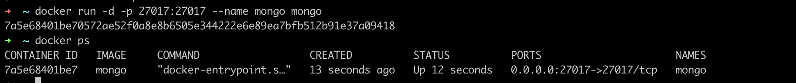
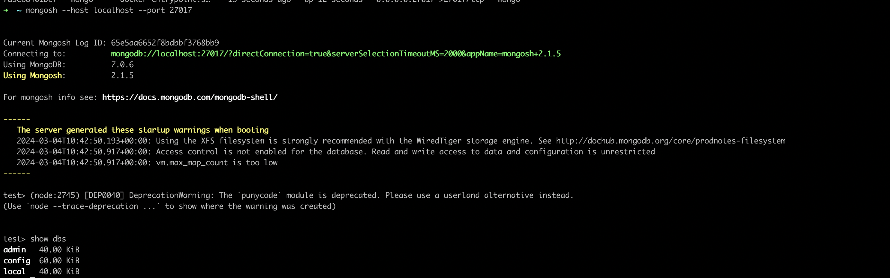
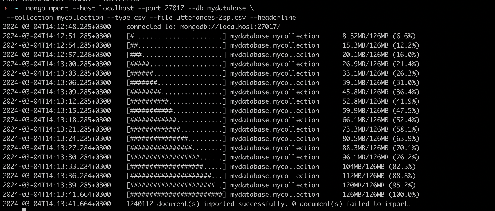
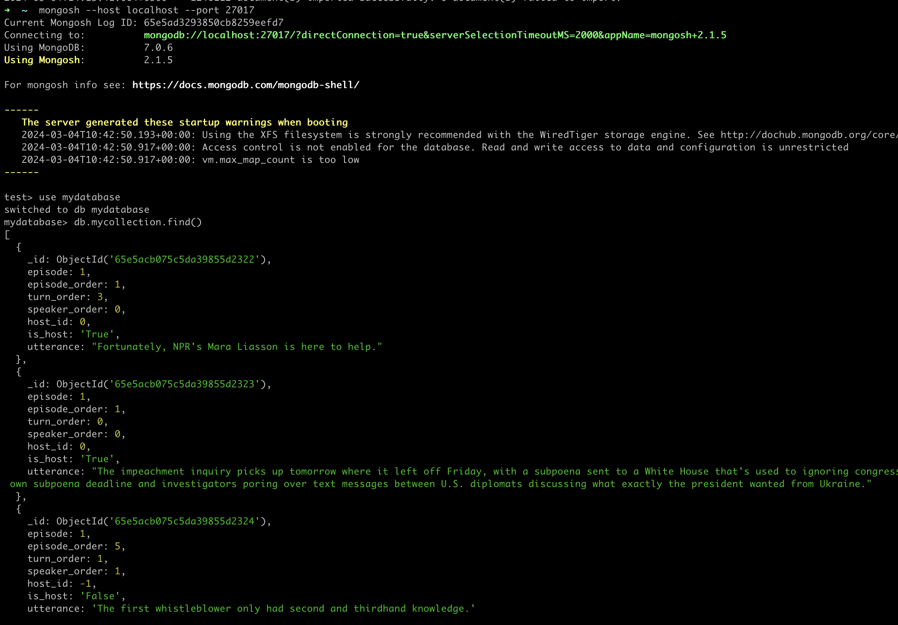
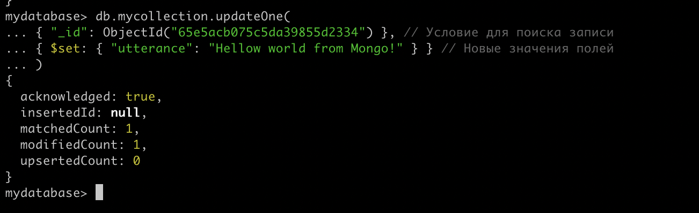
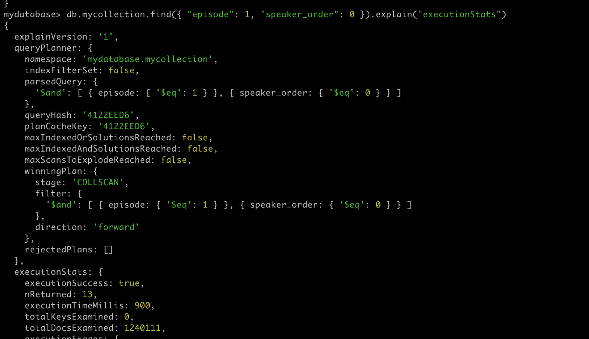
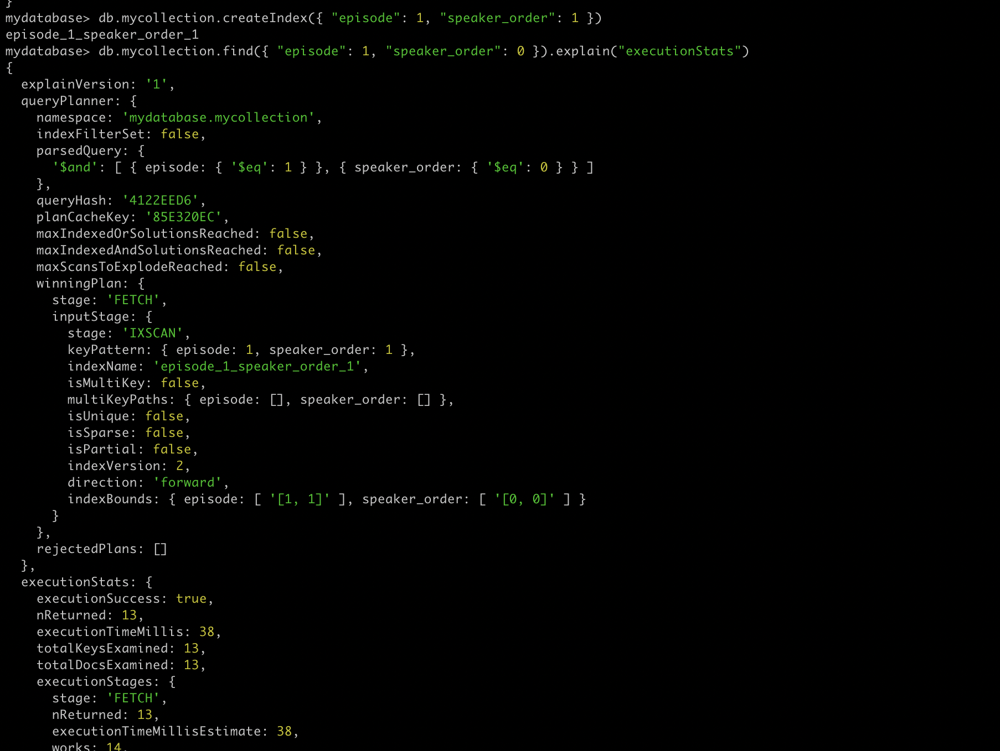

# Отчет о выполнении ДЗ по MongoDB

1) Сначала скачиваем докер образ и запускаем контейнер *MongoDB*

    `docker run -d -p 27017:27017 --name mongodb mongo`



2) Ставим mongo клиент, чтобы из командной строки выполнять команды

    ```
   brew tap mongodb/brew
   brew update
   brew install mongodb-community@7.0`
   ```
   
3) Проверяем, что клиент скачан и может заходить в контейнер

`mongosh --host localhost --port 27017`



4) Скачиваем датасет из [хабра](https://habr.com/ru/companies/edison/articles/480408/)
Я выбрал датасет расшифровки радиограмм NPR:
   
   https://www.kaggle.com/datasets/shuyangli94/interview-npr-media-dialog-transcripts?resource=download

5) Далее распаковываем zip архив, достаем какой-нибудь `csv` формата файл и загружаем этот датасет в MongoDB:

 ```
 mongoimport --host localhost --port 27017 --db mydatabase \
 --collection mycollection --type csv --file utterances-2sp.csv --headerline
 ```



6) Используем опять клиент, чтоб выполнить CRUD операци в рамках импортированного датасета. Для начала прочитаем данные:

    ```
    mongosh --host localhost --port 27017
    test> use mydatabase
    mydatabase> db.mycollection.find()
    ```
   


7) Операция update:

    ```
   mydatabase> db.mycollection.updateOne(
   ... { "_id": ObjectId("65e5acb075c5da39855d2334") }, // Условие для поиска записи
   ... { $set: { "utterance": "Hellow world from Mongo!" } } // Новые значения полей
   ... )
   ```
   


8) Операция delete:

`mydatabase> db.mycollection.deleteOne({ "_id": ObjectId("65e5acb075c5da39855d2334") })`


9) Создание индекса и сравнение производительности запросов:

```
// Сначала выполним поиск без индекса замерив время выполнения
mydatabase> db.mycollection.find({ "episode": 1, "speaker_order": 0 }).explain("executionStats")
// Получаем 900 ms
// Далее создаём составной индекс
mydatabase> db.mycollection.createIndex({ "episode": 1, "speaker_order": 1 })
// И повторяем операцию поиска
mydatabase> db.mycollection.find({ "episode": 1, "speaker_order": 0 }).explain("executionStats")
// Получаем executionTimeMillis: 38, то есть 38 ms
```

Получили прирост во времени выполнения в 25 раз!
И научились работать с mongo)





------------
# Вывод
Самое главное что могу сказать: у mongoDB очень приятная и понятная документация из-за этого работать с ней довольно просто.
Ну и к тому же это одна из самых популярных NoSQL баз во многом из засвоей простоты.
