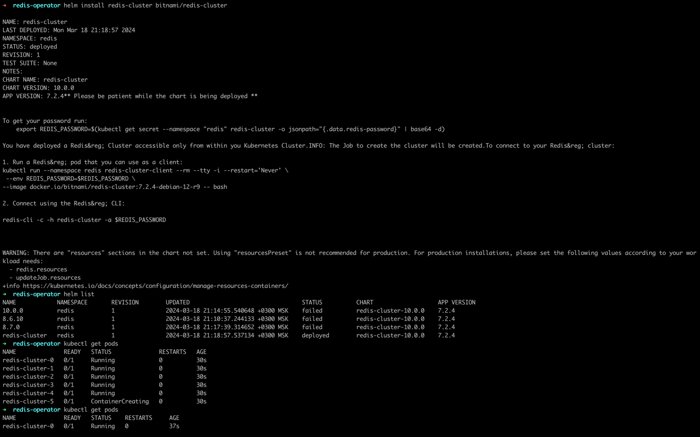
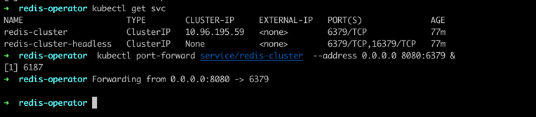
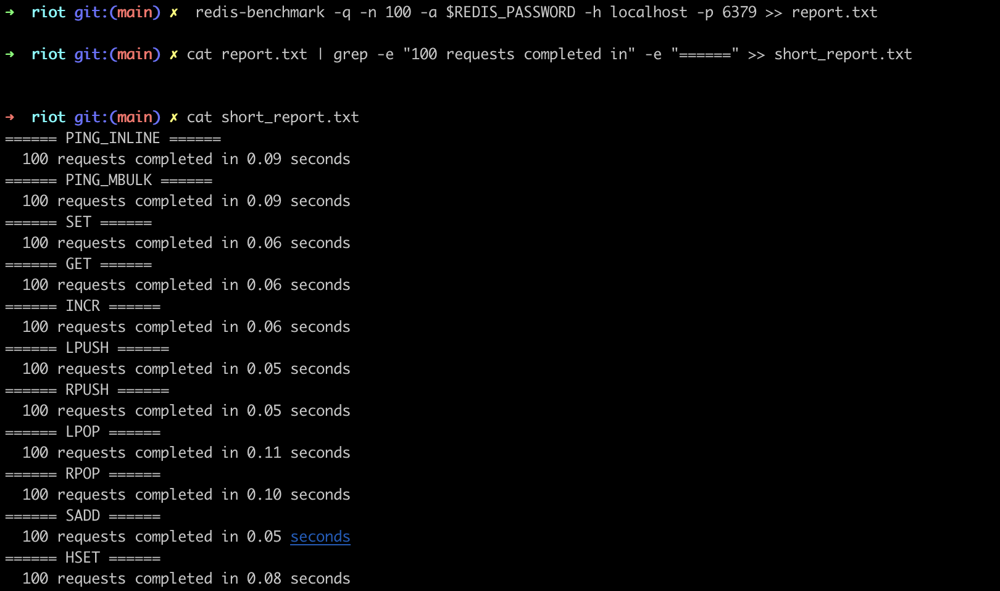

# Отчет о выполнении ДЗ по Redis

Я решил сразу поставить готовый Redis в локальном Kubernetes кластере, используя известный helm chart: https://artifacthub.io/packages/helm/bitnami/redis
Таким образом, мне не придётся настраивать самому репликацию, volumes и сам Kubernetes.

1) Ставим kind - утилита, которая позволяет создавать легкие кластеры Kubernetes с использованием Docker контейнеров в качестве узлов. 
И также ставим kubectl - клиент для Kubernetes, helm - для автоматизированного запуска чарта, `redis-stack` - Redis клиент,
`redis-developer/tap/riot` - отдельная утилита для импорта json в Redis

```
brew install kind
brew install kubectl
brew install helm
brew tap redis-stack/redis-stack
brew install redis-stack
```

2) Создаем кластер для Redis

`kind create cluster --name redis --image kindest/node:v1.23.5`


3) Добавляем [helm chart](https://artifacthub.io/packages/helm/bitnami/redis) в репозиторий и запускаем кластер

 ```
   helm repo add bitnami https://charts.bitnami.com/bitnami
   helm install redis-cluster bitnami/redis
   ```

Проверяем, статус `redis-cluster`, необходим статус `deployed`

```
helm list
```



4) Ждём пока все поды запустятся. Когда все статусы будут `Running` можно переходить к следующему шагу

`kubectl get pods`

5) Пробрасываем порт до сервиса, чтобы подключаться с хоста

```
kubectl get svc
kubectl port-forward service/redis-cluster --address 0.0.0.0 6379:6379 &
```



6) Кладем пароль в переменную окружения, ровно тоже что нас просят в выхлопе команды `helm install redis-cluster bitnami/redis`

`export REDIS_PASSWORD=$(kubectl get secret --namespace "redis" redis-cluster -o jsonpath="{.data.redis-password}" | base64 -d)`

7) Выбираем датасет в формате JSON и скачиваем. Либо как я сделал, просто сгенерировал json на сайте https://www.jsongenerator.io

Сохраняем его в файл `generated.json`

8) Далее самое сложное (то на что я потратил больше всего времени). Нам нужно импортировать этот `json` в кластер. Но утилиты для этого я не нашел, а стандартная `redis-cli` не способна импортировать `json`.
После долгих поисков, я решил написать код на `Go`, который читает `generated.json` файл и импортирует его в кластер Redis в различных структурах данных.
А именно string, hset, zset, list. Исходник - в папке `importer`.

`
JSON_PATH=<путь до файла generated.json> go run importer/main.go # Если выдано ошибку аутентификации, то выполните фаг (6) еще раз
`

После чего ждём примерно 5 минут пока данные загрузятся. Всего данных 19Mb * 4 структуры данных = 76Mb

8) Далее тестируем скорость сохранения и чтения

`
redis-benchmark -q -n 100 -a $REDIS_PASSWORD -h localhost -p 6379 >> report.txt
`

В файле `report.txt` лежит полный отчет скорости сохранения и чтения

Давайте выделим самое важное для нас и сохраним в `short_report.txt`

`
cat report.txt | grep -e "100 requests completed in" -e "======" >> short_report.txt
`




Оба отчета прикрепил положил в папку `report`. По ним можно однозначно сказать что не зависимо от обьема данных и структуры данных наши запросы выполняются практически одинаково быстро за счет того, что данных в Redis лежат в оперативной памяти.

------------

# Вывод:

Удобно, что много документации написано с Redis и самое главное, что она понятная. И синтаксис максимально простой. 
В целом мне все понравилось, кроме того, что я не нашел (возможно плохо искал) утилиту для импорта данных в Redis.
За счет Helm-чартов развернуть кластер уже настроенный с репликацией, отказоустойчивостью и таймаутами - задача 5 минут. А если руками это делать нужно будет прописывать Volume под каждую реплику в конфигах, создавать Sentinel для отказоустойчивости. Вообщем задача на день минимум.
По итогу я развернул настроенный Redis кластер в Kubernetes и протестировал на нем скорость запросов.
