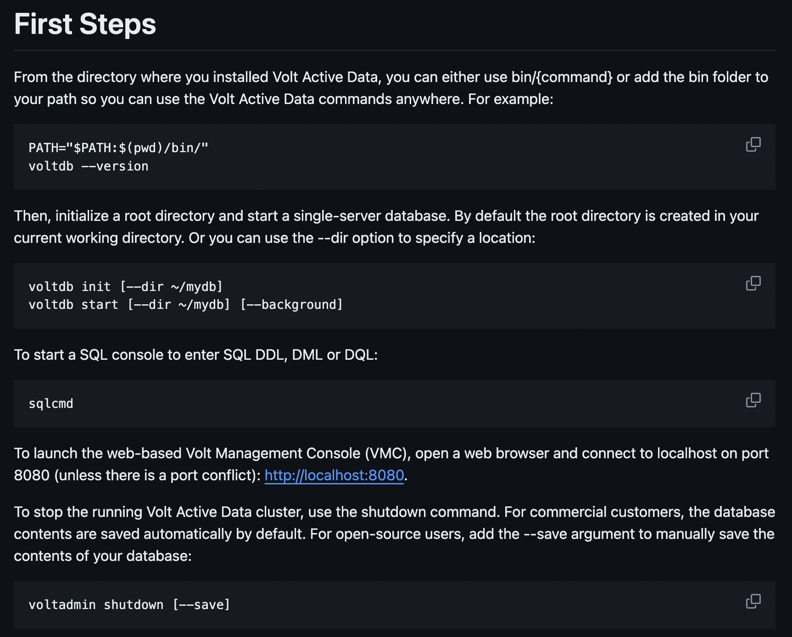
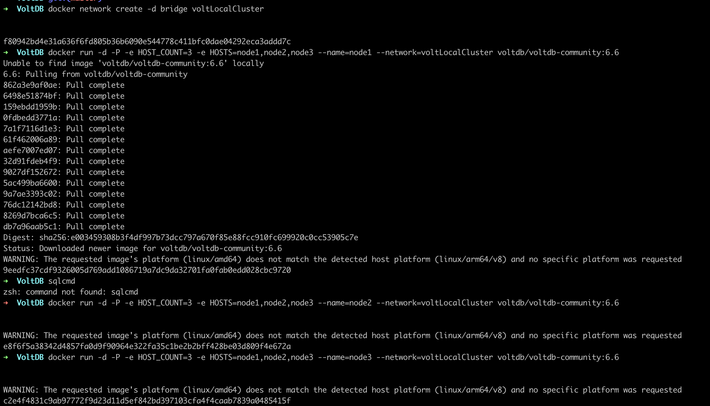
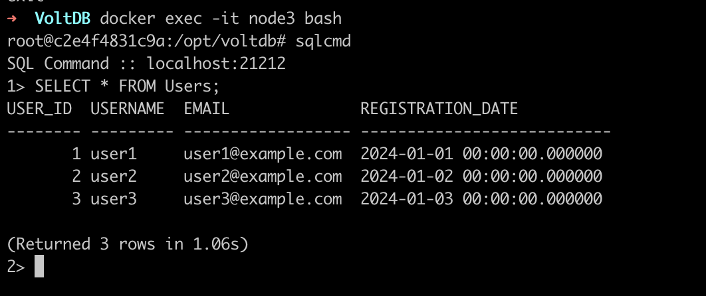
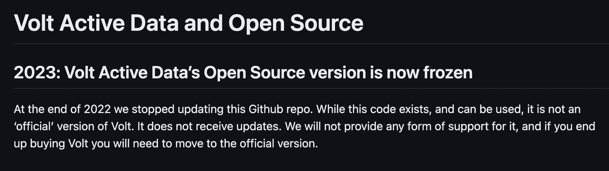

### Домашняя работа №4: Знакомство с Relational VoltDB

1. **История развития СУБД**
    - Relational VoltDB - это in-memory NewSQL база данных, разработанная для обеспечения высокой производительности и масштабируемости. Она была выпущена в 2010 году компанией VoltDB, основанной Майклом Стоунбрейкером, который также является одним из создателей базы данных Ingres и Postgres.
    - Это ACID -совместимая СУБД , использующая архитектуру без общего доступа и созданная на основе работы Stonebraker по производительности и оптимизации OLTP-системы.
Он доступен как в корпоративной, так и в общественной версии. Выпуск для сообщества распространяется под лицензией GNU Affero General Public License.
    - В феврале 2022 года продукт был переименован в Volt Active Data.
    - Подробности можно найти на [wiki](https://en.wikipedia.org/wiki/VoltDB)
2. **Инструменты для взаимодействия с СУБД**
    - Для взаимодействия с Relational VoltDB можно использовать официальный клиентский драйвер, JDBC драйвер или SQL командную строку.
    - Все основные инструменты и примеры находятся на [github](https://github.com/VoltDB/voltdb)
      

3. **Database Engine**
    - Relational VoltDB использует собственный database engine - "VoltDB Database Engine". Спроектированный для работы с оперативной памятью и обеспечения высокой производительности транзакционных операций.
4. **Язык запросов**
    - Relational VoltDB использует SQL для запросов к данным. Давайте создадим базу данных с данными и выполним несколько запросов:
```
      CREATE TABLE Users (
      id INT,
      name VARCHAR(50),
      age INT
      );

   INSERT INTO Users (id, name, age) VALUES (1, 'Alice', 30);
   INSERT INTO Users (id, name, age) VALUES (2, 'Bob', 25);

   SELECT * FROM Users;
```

5. **Распределение файлов БД**
    - VoltDB, являясь распределенной базой данных в оперативной памяти, обычно не хранит свои данные на диске таким же образом, как традиционные дисковые базы данных. Однако она поддерживает сохранение данных на диске для обеспечения надежности и отказоустойчивости.

    - В VoltDB данные распределяются по нескольким узлам кластера. Каждый узел хранит часть данных, а репликация данных обеспечивает отказоустойчивость. Когда дело доходит до сохранения данных на диске, VoltDB использует комбинацию таких методов, как создание моментальных снимков и ведение журнала команд.

    - Для создания моментальных снимков необходимо периодически записывать состояние базы данных в памяти на диск. Это позволяет системе восстанавливать работоспособность в случае сбоя. Кроме того, VoltDB регистрирует каждую команду, которая изменяет состояние базы данных. Эти журналы команд также можно использовать для восстановления.

    - Хотя VoltDB не обеспечивает явного контроля над распределением файлов базы данных по различным физическим устройствам хранения, вы можете настроить параметры дискового хранилища для оптимизации производительности и надежности в зависимости от вашей инфраструктуры. Это может потребовать выбора подходящих типов дисков, конфигураций RAID и подсистем хранения в соответствии с вашими требованиями к производительности и отказоустойчивости.

6. **Язык программирования**
    - Java

7. **Типы индексов**
    - В Relational VoltDB поддерживаются обычные индексы и уникальные индексы. Пример создания индекса:

```     
CREATE INDEX idx_name ON Users(name); 
CREATE UNIQUE INDEX idx_id ON Users(id);
```


8. **Выполнение запросов**
    - В VoltDB процесс выполнения запросов происходит следующим образом:
    - Клиентский запрос: Сначала клиентский запрос отправляется на один из узлов в VoltDB кластере. Этот узел называется координатором (coordinator).
    - Планирование запроса: Координатор анализирует запрос и разбивает его на подзапросы, если необходимо. Каждый подзапрос выполняется на том узле, который содержит часть данных, необходимых для его выполнения.
    - Распределение запроса: Координатор отправляет подзапросы соответствующим узлам в кластере. Эти узлы, называемые исполнителями (executors), обрабатывают подзапросы параллельно.
    - Выполнение запроса: Исполнители выполняют свои подзапросы непосредственно над данными, хранящимися локально на каждом узле. Это минимизирует задержки связи и обеспечивает высокую скорость выполнения.
    - Объединение результатов: После выполнения всех подзапросов результаты объединяются на координаторе и возвращаются клиенту.
    - Этот процесс основан на архитектуре shared-nothing, где каждый узел в кластере содержит свой собственный набор данных и выполняет запросы параллельно. Такой подход обеспечивает высокую пропускную способность и масштабируемость для обработки больших объемов транзакций в реальном времени.

9. **План запросов**
    - Да, в VoltDB также существует понятие "плана запросов" (query plan). План запросов представляет собой оптимизированный план выполнения запроса к базе данных, который определяет порядок операций и способы доступа к данным для выполнения запроса как можно более эффективно.
    - При поступлении SQL-запроса к базе данных VoltDB, система оптимизации запросов анализирует запрос и создает план выполнения, который включает в себя следующие этапы:
    - Парсинг запроса: SQL-запрос разбирается на лексемы и проверяется на корректность синтаксиса.
    - Анализ запроса: система анализирует запрос и строит дерево синтаксического разбора, определяя необходимые таблицы, столбцы, условия и операции.
    - Оптимизация запроса: на основе анализа запроса система оптимизации выбирает оптимальный план выполнения, учитывая доступные индексы, статистику данных, объем информации и другие факторы.
    - Генерация плана выполнения: на этом этапе система генерирует фактический план выполнения запроса, определяя порядок операций (например, сканирование таблиц, использование индексов, объединение данных) и способы доступа к данным.
    - Выполнение запроса: полученный план выполнения используется для выполнения запроса к базе данных, что позволяет минимизировать время выполнения и ресурсы, необходимые для обработки запроса. 
    - Этап планирования запросов в VoltDB играет ключевую роль в обеспечении высокой производительности выполнения SQL-запросов, поскольку позволяет оптимизировать доступ к данным и выбирать наиболее эффективные методы обработки запросов.
   
10. **Транзакции**
    - Relational VoltDB поддерживает транзакции ACID (Atomicity, Consistency, Isolation, Durability), обеспечивая надежность и целостность данных.

11. **Методы восстановления**
    - В случае сбоев или потери данных, Relational VoltDB поддерживает механизмы резервного копирования и восстановления данных.

12. **Шардинг**
    - VoltDB поддерживает шардинг данных, что позволяет распределить данные по разным узлам в кластере для обеспечения масштабируемости и улучшения производительности. Принцип работы шардинга в VoltDB основан на распределенной архитектуре shared-nothing.
    - В VoltDB используется два основных типа шардинга данных:
    - Шардинг по ключу (Key-based Sharding): В этом типе шардинга каждая запись данных ассоциируется с определенным ключом, и этот ключ используется для определения, на каком узле кластера данные будут храниться. Когда запрос поступает на выполнение, система определяет, на каком узле находятся данные, необходимые для выполнения запроса, и направляет запрос к соответствующему узлу.
    - Шардинг по диапазону (Range-based Sharding): В этом типе шардинга данные разбиваются на диапазоны на основе какого-либо атрибута или ключа. Каждый узел кластера отвечает за хранение определенного диапазона данных. При выполнении запроса система определяет диапазон данных, необходимых для запроса, и направляет его на соответствующий узел.
    
13. **Data Mining, Data Warehousing, OLAP**
    - VoltDB в первую очередь ориентирована на операционные транзакции и аналитику в реальном времени, поэтому в ней отсутствуют некоторые функциональности, характерные для систем хранения данных и аналитических баз данных.
    - Data Mining (добыча данных): VoltDB не является специализированной платформой для проведения сложных анализов данных и поиска скрытых закономерностей. Однако, при необходимости, можно экспортировать данные из VoltDB в другие системы, специализированные на Data Mining.
    - Data Warehousing (хранение данных): VoltDB предоставляет возможность хранения и обработки данных в оперативной памяти для операционных целей, но не является типичной системой хранения данных для построения хранилищ данных (Data Warehouse). Для аналитических целей и хранения больших объемов исторических данных рекомендуется использовать специализированные решения для хранилищ данных.
    - OLAP (Online Analytical Processing): VoltDB не обладает встроенными возможностями OLAP-анализа, который часто требуется для многомерного анализа данных. Однако, можно интегрировать VoltDB с другими OLAP-системами или BI-платформами для проведения аналитических операций над данными, хранящимися в VoltDB.
    - Таким образом, хотя VoltDB не является полноценной системой Data Mining, Data Warehousing или OLAP, она может успешно использоваться в качестве оперативной базы данных для обработки транзакций в реальном времени и аналитики на основе операционных данных. В случае необходимости выполнения сложных аналитических задач, рекомендуется комбинировать VoltDB с другими специализированными инструментами и платформами.
    
14. **Методы защиты**
    - Шифрование трафика: VoltDB поддерживает шифрование сетевого трафика с использованием протокола SSL/TLS, что обеспечивает защищенную передачу данных между клиентами и серверами базы данных.
    - Модели авторизации и аутентификации: VoltDB предоставляет гибкие механизмы управления доступом к данным и операциям, включая возможность настройки ролей, привилегий и прав доступа для пользователей и приложений.
    - Аудит действий: VoltDB позволяет вести журнал аудита операций, что позволяет отслеживать и контролировать изменения данных, выполнение запросов и другие действия в системе.
    - Отказоустойчивость и восстановление данных: VoltDB обеспечивает механизмы репликации данных и автоматического восстановления после сбоев, что повышает надежность и доступность системы.
    - Защита от SQL-инъекций и других уязвимостей: VoltDB предоставляет механизмы защиты от типичных атак, таких как SQL-инъекции, благодаря использованию параметризованных запросов и других средств безопасности.
    - Контроль целостности данных: VoltDB обеспечивает средства для обеспечения целостности данных, включая транзакции ACID, проверку ограничений целостности и другие механизмы.

15. **Сообщества и разработчики**
    - VoltDB, Inc. - Это основная компания, стоящая за разработкой и коммерциализацией VoltDB. Она владеет правами на коммит и создание дистрибутивов версий. VoltDB, Inc. управляет основной кодовой базой VoltDB и вносит в нее изменения.
    - Но в 2023 году VoltDB вышла из Open Source и перестала поддерживать их github repo

16. **Создание своих данных** 
    Теперь к практике: самый быстрый и легкий способ поставить voltdb - через docker. Поэтому скачиваем на [dockerhub](https://hub.docker.com/r/voltdb/voltdb-community) образ voltdb.
    На страничке [dockerhub](https://hub.docker.com/r/voltdb/voltdb-community) даже есть гайд по установке кластера из 3х нод voltdb. Приступаем:
```
docker pull voltdb/voltdb-community:6.6

docker network create -d bridge voltLocalCluster
docker run -d -P -e HOST_COUNT=3 -e HOSTS=node1,node2,node3 --name=node1 --network=voltLocalCluster voltdb/voltdb-community:6.6
docker run -d -P -e HOST_COUNT=3 -e HOSTS=node1,node2,node3 --name=node2 --network=voltLocalCluster voltdb/voltdb-community:6.6
docker run -d -P -e HOST_COUNT=3 -e HOSTS=node1,node2,node3 --name=node3 --network=voltLocalCluster voltdb/voltdb-community:6.6
docker exec -it node1 bash
```



После того как зашли в контейнер используем утилиту `sqlcmd` как клиент базы и заполняем данными для демонстрации работы СУБД

```
root@9eedfc37cdf9:/opt/voltdb# sqlcmd
SQL Command :: localhost:21212
1> CREATE TABLE Users (
2>     user_id BIGINT PRIMARY KEY,
3>     username VARCHAR(255),
4>     email VARCHAR(255),
5>     registration_date TIMESTAMP
6> );
Command succeeded.
7>
7> CREATE TABLE Orders (
8>     order_id BIGINT PRIMARY KEY,
9>     user_id BIGINT,
10>     order_date TIMESTAMP,
11>     total_amount DECIMAL(10, 2),
12>     FOREIGN KEY (user_id) REFERENCES Users(user_id)
13> );
Command succeeded.
```

```
27> INSERT INTO Users (user_id, username, email, registration_date)
28> VALUES (1, 'user1', 'user1@example.com', '2024-01-01 00:00:00');
(Returned 1 rows in 0.57s)
29> INSERT INTO Users (user_id, username, email, registration_date)
30> VALUES (2, 'user2', 'user2@example.com', '2024-01-02 00:00:00');
(Returned 1 rows in 0.22s)
31>
31> INSERT INTO Users (user_id, username, email, registration_date)
32> VALUES (3, 'user3', 'user3@example.com', '2024-01-03 00:00:00');
(Returned 1 rows in 0.17s)
33> SELECT * FROM Users;
USER_ID  USERNAME  EMAIL              REGISTRATION_DATE
-------- --------- ------------------ ---------------------------
       1 user1     user1@example.com  2024-01-01 00:00:00.000000
       2 user2     user2@example.com  2024-01-02 00:00:00.000000
       3 user3     user3@example.com  2024-01-03 00:00:00.000000

(Returned 3 rows in 0.28s)
34>
34> SELECT COUNT(*) AS total_users FROM Users;
TOTAL_USERS
------------
           3

(Returned 1 rows in 0.23s)
```

Теперь идем в 3ю ноду для проверки, что данные в кластере успешно реплицировались



## Profit!!!

17. **Обучение и документация**
    - Документацию по Relational VoltDB можно найти на официальном сайте проекта. Для обучения можно изучать примеры кода и выполнять задачи из учебных материалов.
    - Основная ссылка с документацией: https://docs.voltdb.com/

18. **Следить за новостями**
    - Чтобы быть в курсе последних новостей по Relational VoltDB, рекомендуется подписаться на рассылку новостей проекта или следить за обновлениями на официальном сайте: https://www.voltactivedata.com/
    - Следует учеть, что с 2023 года vaultdb больше не обновляется на github, так что лучше следить на их официальном сайте.
      
### Вывод

В заключение отметим, что Relational VoltDB - это отличный выбор для организаций, которым требуется высокопроизводительное, масштабируемое и совместимое с ACID решение для баз данных для приложений реального времени. Его сочетание обработки данных в оперативной памяти, распределенной архитектуры, поддержки SQL и возможностей потоковой обработки делает его хорошо подходящим для широкого спектра вариантов использования в современных средах, управляемых данными. Однако, как и в случае с любой технологией, ее пригодность должна оцениваться на основе конкретных прикладных требований и соображений, таких как объем данных, ожидаемая производительность и сложность эксплуатации.